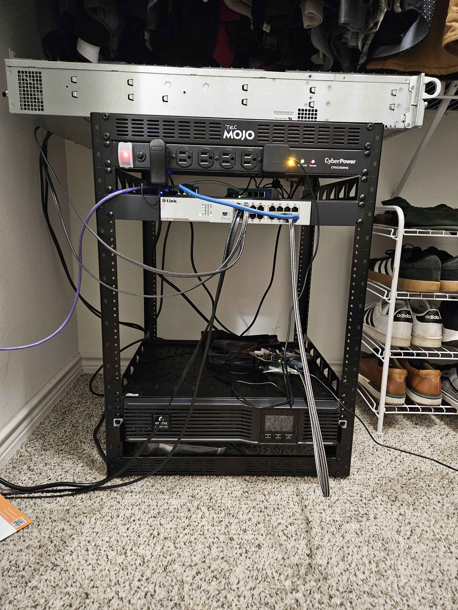

# homelab

Very much a work in progress project. I have not had too much time to mess with over summer since I have barely been home.

# Description

I have a Mikrotik hEX serires ethernet router plugged into my modem. There is a Mikrotik hAP in bridge mode connected to port 2 on the router. Port 5 of the router connects to a 16 port switch. The switch is connected to my SuperMicro X10 based server and a Raspberry Pi 4B.

= The Server

The SuperMicro server is my chance to experiment with enterprise hardware; it is a bit dated but it is what I could get my hands on. I have not yet had time to configure it but the plan is NixOS installed on a SATA DOM, they system has 12 hotswap SAS drivebays that will host a ZFS filesystem running a software RAID. The system has a RAID controller but it is 1. not great, 2. for ZFS you want to pass the drives through directly. The server will host an Immich server, Jellyfin server, and Copyparty. I will also run a Minecraft server for my friends to play on.

I currently need to purchase a SATA DOM for the OS and more drives for the system.

# The Pi

The Pi is my entry point into the network when I need access but nothing else is working. The Pi is very consistant with extremely low power draw so it is always on. Lately I have been toying with the server from a distance by SSHing into the Pi and using it to turn on my PC with WoL, then I can connect to my PC with RustDesk and configure the server with IPMI View.

# Issues

The server rack I have is about 22" deep, my server is about 30" deep. I need to get a deeper server rack, and probably a smaller server.

The server I have is just an experiment to learn, in practice and in the future I will likely want something easier to work on that draws less power. The SuperMicro server is very cool, but it is hard to work on (mostly because of proprietary parts and bad interoperability), it has a high power draw, and it is computationally weaker than a modern system with cheaper parts. 

# Goals

* New HBA card
* Larger (deeper) server rack
* New Server

  

